### 👋 Hi, I'm Jonathan
I'm currently a consultant (non-freelance). This GitHub is just for fun. I do the following in the order of competence:
- **Software Engineering (Applications)** - KPIs, Full Stack Systems, Docker
- **Cloud Engineering** - Kubernetes, GCP, AWS, Terraform
- **DevOps** - GH Actions, ArgoCD, ARC
- **Data Engineering** - Data Pipelines, ML Ops, DataBricks
- **Data Science** - Machine Learning, Statistics
- **IT Systems** - Self-hosting, Networking
- **Software Engineering (Embedded)** - Micro controllers

#### Stats

**Jupyter Notebooks and HTML hidden for clarity*
